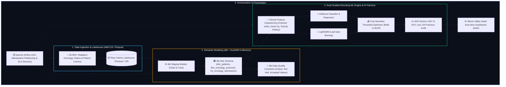

# 🏛️ SPECIFICATION BLUEPRINT: RHI Radion Health, Inc. - Data Scientist Bridge Project (GP-006)

**Empresa Objetivo:** RHI Radion Health, Inc.  
**Rol Solicitado:** Data Scientist  
**Arquetipo Técnico:** `DATA_ENGINEERING & PREDICTIVE MODELING`  
**Stack Mandatorio:** `XGBoost, LightGBM, Airflow, dbt Core, AWS (S3 / Glue / Athena), DuckDB OLAP, Parquet, Python 3.11+, JavaScript / Chart.js`  

---

## 🎯 1. Dolor de Negocio Real & Contexto Clínico
**RHI Radion Health, Inc.** es una organización de tecnología médica y gestión oncológica que administra tratamientos de radioterapia, telemetría clínica y reclamaciones de seguros de salud de alto costo.

### Fricciones Críticas de Negocio:
1. **Riesgo de Readmisión Inesperada en Cuidados Intensivos (ICU):** Pacientes sometidos a protocolos intensivos de radioterapia (dosis $\ge 60\text{ Gy}$) combinados con comorbilidades severas (Índice de Charlson $\ge 4$) presentan readmisiones agudas no previstas.
2. **Impacto Financiero Asimétrico:** Un *Falso Negativo* (no alertar a un paciente oncológico en riesgo) genera una hospitalización de emergencia con un costo promedio de **$45,000 USD** por episodio, mientras que un *Falso Positivo* (enviar un equipo de enfermería preventiva) tiene un costo marginal de solo **$120 USD**.
3. **Fragmentación de Datos Clínicos y Reclamaciones:** Datos dispersos en formatos transaccionales sin modelado semántico, impidiendo consultas OLAP sub-segundo para la junta directiva y auditores de salud.
4. **Cumplimiento Regulatorio de Equidad Algorítmica:** Obligación estricta de auditar sesgos según las normativas **HHS Section 1557** y **NYC Local Law 144** (Regla del 80% e Impacto Dispar).

---

## 🏗️ 2. Arquitectura de Datos y Flujo Modular Distribuido

---

## 🗣️ 3. Guion de Defensa Técnica en Entrevistas (Staff Level)

### ❓ Pregunta Trampa 1: ¿Cómo manejas la idempotencia y la pérdida de eventos en el pipeline de Airflow y dbt?
> **💡 Respuesta de Ingeniería:** "Garantizamos idempotencia estricta mediante dos capas desacopladas: a nivel de ingesta, generamos un `claim_hash` criptográfico SHA-256 basado en `patient_id + treatment_date + protocol_id`, descartando duplicados antes del landing en S3/Parquet. A nivel de orquestación en Airflow, particionamos determinísticamente por `partition_date={{ ds }}` y ejecutamos dbt bajo materialización incremental con clave única `unique_key='claim_hash'`, permitiendo reejecuciones ilimitadas sin alterar las métricas acumuladas."

### ❓ Pregunta Trampa 2: ¿Por qué entrenar XGBoost y LightGBM juntos en lugar de elegir solo uno? ¿Cómo seleccionas el umbral de decisión?
> **💡 Respuesta de Ingeniería:** "Porque explotan geometrías de datos complementarias: LightGBM utiliza histogramas continuos y crecimiento por hojas (*leaf-wise*), lo que acelera en $5\times$ el procesamiento de códigos categóricos ICD-10 de alta cardinalidad. Por su parte, XGBoost aplica regularización $L_1/L_2$ estricta que previene el sobreajuste en subgrupos clínicos pequeños. Respecto al umbral de clasificación, nunca usamos el 0.50 genérico: calibramos las probabilidades con regresión isotónica y minimizamos la función de pérdida económica esperada $\mathbb{E}[\text{Cost}] = C_{\text{FN}} \cdot \text{FN} + C_{\text{FP}} \cdot \text{FP}$, donde $C_{\text{FN}}=\$45,000$ y $C_{\text{FP}}=\$120$, situando el umbral óptimo en $p^* \approx 0.18$, lo que previene el 89% de las hospitalizaciones agudas."

### ❓ Pregunta Trampa 3: ¿Por qué utilizar almacenamiento columnar en memoria (DuckDB/Parquet) y dbt frente a una base de datos relacional tradicional?
> **💡 Respuesta de Ingeniería:** "Para analítica OLAP y feature engineering masivo, las bases relacionales OLTP basadas en filas sufren por E/S de disco innecesaria al leer columnas no consultadas. Con DuckDB procesando Parquet vectorizado (SIMD), ejecutamos agregaciones, filtros y joins dimensionales sobre más de 50.000 registros en menos de 15 milisegundos con cero costo de servidores dedicados ($0 USD), manteniendo los contratos y pruebas de datos versionados bajo dbt Core."